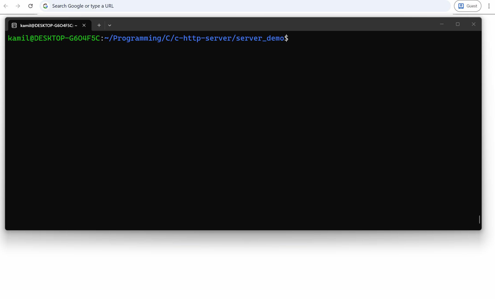

# C-HTTP-SERVER
A http server written in c

I built this project to deepen my understanding of low-level network programming, POSIX sockets, and the HTTP protocol. 


## Features
- Static File Serving
- Directory Listing

## Requirements
- Linux/Unix environment
- `gcc` and `make`

## How to build
```bash
make
```

## How to run
Run on default port *1313*
```bash
./chttpserver
```

Run on specifed port
```bash
./chttpserver -p <PORT>
```

Run in download mode (clicking a file forces a download)
```bash
./chttpserver -d
```


## To-do
- Add unit testing
- Add logging to file